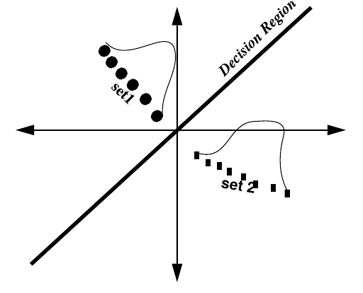

```{r setup, include=FALSE}
knitr::opts_chunk$set(message = FALSE)
library(tidyverse)
theme_set(theme_bw())
```

### 1. Введение
Метод главных компонент (PCA, Principal Component Analysis) применим к числовым данным, в которых строчки --- это точки наблюдения, а столбцы --- это исследуемые переменные. Данный метод часто приводят и используют как метод уменьшения размерности, однако я разделяю мнение, согласно которому это лишь метод смены перспективы, в результаты которого некоторое количество размерностей становится маловажными.

#### 1.1 Библиотеки
```{r}
library(tidyverse)
library(ggfortify)
library(GGally)
```

#### 1.2 Фамильная честь Вустеров
В данной лекции я буду использовать данные из романа П. Г. Вудхауза [“Фамильная честь Вустеров”](https://en.wikipedia.org/wiki/The_Code_of_the_Woosters). В датасете собраны несколько переменных:

* chapter --- номер главы
* гарольд --- частотность появления имени в каждой из глав
* гасси --- частотность появления имени в каждой из глав
* далия --- частотность появления имени в каждой из глав
* дживс --- частотность появления имени в каждой из глав
* мадлен --- частотность появления имени в каждой из глав
* оутс --- частотность появления имени в каждой из глав
* спод --- частотность появления имени в каждой из глав
* стиффи --- частотность появления имени в каждой из глав
* сэр --- частотность появления имени в каждой из глав

```{r}
wodehouse <- read.csv("https://goo.gl/8RJDwK")
library(GGally)
ggpairs(wodehouse[,-1])
```


### 2. Дисперсия, ковариация, корреляция Пирсона

$$var(X) = \frac{\sum_{i = 1}^n(x_i - \bar{x})^2}{n - 1}$$

$$cov(X, Y) = \frac{\sum_{i = 1}^n(x_i - \bar{x})(y_i-\bar{y})}{n - 1}$$

```{r}
cov(wodehouse[,-1])
```

$$cor(X, Y) = \frac{cov(X, Y)}{\sigma_X\times\sigma_Y}$$

```{r}
cor(wodehouse[,-1])
```


### 3. Собственный вектор, собственное значение

Как вы знаете, матрицы можно перемножать. [Подсказка](https://upload.wikimedia.org/wikipedia/commons/e/eb/Matrix_multiplication_diagram_2.svg).

```{r}
m1 <- matrix(c(2, 2, 3, 1), nrow = 2)
m2 <- matrix(c(1, 3), nrow = 2)
m3 <- matrix(c(3, 2), nrow = 2)
m1
m2
m1 %*% m2
m1
m3
m1 %*% m3
```

В первом примере мы получили матрицу $\left(\array{11\\ 5}\right)$, а во втором случае $\left(\array{12\\ 8}\right) = 4 \times \left(\array{3\\ 2}\right)$, т. е. при умножении матрицы мы получили значение, равное скалярному умножению той же самой матрицы.

Мы можем думать об одной матрице, как о векторе $\left(\array{3\\ 2}\right)$ в двумерном пространстве. Тогда матрица $\left(\array{2 & 3\\ 2 & 1}\right)$ --- это матрица некоторой трансформации А, которая изменяет вектор $\left(\array{3\\ 2}\right)$. В таком случае **собственный вектор (eigenvector)** --- это тот постянный объект, который подвергается трансформации, а **собственное значение (eigenvalues)** --- это скалярный мультипликатор собсвтенного вектора (в нашем случае собственное значение равно 4).

Свойства собсвтенных векторов:

* собственные векторы можно найти только для квадратных матриц (и то не для всех)
* все собственные векторы матрицы перпендекулярны друг другу вне зависимости от размерности.
* принято задавать собственные векторы длинной 1, так что найдя собственный вектор $\left(\array{3\\ 2}\right)$, мы узнаем его длинну $$\sqrt{3^2+2^2} = \sqrt{13},$$ так что теперь можно отмасштабировать вектор: $$\left(\array{3\\ 2}\right) \times \frac{1}{\sqrt{13}} = \left(\array{3/\sqrt{13}\\ 2/\sqrt{13}}\right)$$

Как найти собственный вектор в R:

```{r}
m <- matrix(c(2, 2, 3, 1), nrow = 2)
eigen(m)
```

Собственные значения в переменной `values` функция всегда возвращает в убывающем порядке, а каждая колонка в переменной `eigenvectors` соответствует элементу в переменной `values`. Сравните со значениями, которые мы получили руками:

```{r}
3/sqrt(13)
2/sqrt(13)
```


### 4. PCA
Обычно переменные, которые используют в PCA **нужно обязательно нормализовать**, но так как мы будем использовать частотность, эти переменные не нуждаются в нормализации. Давайте сравним результат работы функций, которые мы рассмотрели перед этим и функции `prcomp`.

```{r}
eigen(cov(wodehouse[,-1]))
PCA <- prcomp(wodehouse[,-1])
PCA
```

Как читать полученное?  Мы сменили оси координат и в новом пространстве (точно так же 9-мерном) мы можем перейти используя полученные значения:

$$PC1 = гарольд \times 0.03548428 + гасси \times 0.08477226 + далия \times -0.11013760 + дживс \times -0.48849572 +$$ 
$$ + мадлен \times 0.12377778 + оутс \times -0.04712363 + спод \times 0.09814424 + стиффи \times 0.05838698 + сэр \times -0.84274152$$

Как полученные компоненты объясняют дисперсию в переменных?

```{r}
summary(PCA)
```

Т. е. первые две компоненты объясняют почти 80 процентов дисперсии, это достаточно высокое значение, которое позволяет нам применять данный метод.

В выдаче PCA мы видели порядок, который отображает порядок следования в датасете, чтобы не потерять информацию о главе, мы прибегнем к хитрости:
```{r}
wodehouse_2 <- wodehouse[,-1]
rownames(wodehouse_2) <- wodehouse[, 1]
PCA <- prcomp(wodehouse_2)
```

Дальнейшая визуализация возможна благодаря пакету `ggfortify`:

```{r}
library(ggfortify)
autoplot(PCA,
         shape = FALSE,
         loadings = TRUE,
         label = TRUE,
         loadings.label = TRUE)
```

Числа на этом графике --- номера глав романа, красные линии --- оси старых осей координат. Сам график называется биплот. Чем ближе друг к другустарые оси координат, тем больше скоррелированы переменные (вообще, косинус угла между ними равен коэфициенту корреляции между соответствующими переменными).


### 5. Что дальше?

* После того как преобразование сделано можно запскать стандартные методы регрессии, кластеризации и т. д.
* можно использовать некоторые не затронутые в PCA переменные, для анализа в новом пространстве


### 6. 3d пример от Ильи Щурова
[ссылка](http://math-info.hse.ru/f/2015-16/ling-mag-quant/lecture-pca.html#%D0%A2%D1%80%D1%91%D1%85%D0%BC%D0%B5%D1%80%D0%BD%D1%8B%D0%B9%20%D0%BF%D1%80%D0%B8%D0%BC%D0%B5%D1%80)

### 7. Евангелия
```{r, eval = FALSE}
gospels <- read.csv("https://tinyurl.com/y8tcf3uw")
```

Постройте PCA и нарисуйте биплот. Чем вызвано такое расхождение евангелистов?

### 8. Линейный дискриминантный анализ

Линейный дискриминантный анализ (Linear Discriminant Analysis, LDA) очень близок к PCA, но его основная цель --- максимизировать разделяемость известных категорий. Так что если PCA пытается перейти к новым осям координат, беря за основу наибольшую дисперсию в многомерном пространстве, LDA переходит к новым координатам, стараясь оптимизировать разницу между средними и дисперсией известных групп.




### 9. Сравнение PCA и LDA
#### 9.1  Нанайские данные

В этом датасете представлены три нанайских гласных  i, ɪ и e, произнесенные нанайским носителем мужского пола из селения Джуен. Каждая строчка --- отдельное произнесение. Переменные:

* f1 --- первая форманта
* f2 --- вторая форманта

```{r}
nanai <- read_csv("https://goo.gl/9uGBoQ")
nanai %>% 
  ggplot(aes(f2, f1, label = sound, color = sound))+
  geom_text()+
  geom_rug()+
  scale_y_reverse()+
  scale_x_reverse()+
  stat_ellipse()+
  theme(legend.position = "none")+
  labs(title = "Нанайские гласные в произнесении мужчины из селения Джуен")
```

Применим PCA. Обязательно нормировать переменные:
```{r}
pca <- prcomp(nanai[, -1], center = TRUE, scale. = TRUE)
summary(pca)
prop.pca <- paste0(c("PCA1 ", "PCA2 "),
                   "(",
                   round(pca$sdev^2/sum(pca$sdev^2), 2), 
                   "%)")
prop.pca
```

Применим LDA:
```{r}
lda <- MASS::lda(sound ~ f1 + f2, nanai)
lda
prop.lda <- paste0(c("LDA1 ", "LDA2 "),
                   "(",
                   round(lda$svd^2/sum(lda$svd^2), 2), 
                   "%)")
prop.lda
plda <- predict(object = lda, newdata = nanai)
head(plda$x)
```

Соединим все в один датасет:
```{r}
dataset <- data.frame(sound = nanai[,"sound"],
                      pca = pca$x, 
                      lda = plda$x)
```

Визуализируем:
```{r, fig.height= 7}
nanai %>% 
  ggplot(aes(f2, f1, label = sound, color = sound))+
  geom_text()+
  scale_y_reverse()+
  scale_x_reverse()+
  stat_ellipse()+
  theme(legend.position = "none") ->
  p1

dataset %>% 
  ggplot(aes(pca.PC1, pca.PC2, colour = sound, label = sound)) + 
  geom_text() + 
  labs(x = prop.pca[1], y = prop.pca[2])+
  stat_ellipse() +
  theme(legend.position = "none") ->
  p2

dataset %>% 
  ggplot(aes(lda.LD1, lda.LD2, colour = sound, label = sound)) + 
  geom_text() + 
  labs(x = prop.lda[1], y = prop.lda[2])+
  stat_ellipse() +
  theme(legend.position = "none") ->
  p3

gridExtra::grid.arrange(p1, p2, p3)
```


#### 9.2 Register variation in the British National Corpus
Dataset and discription from Natalia Levshina's package `Rling`. This is a data set with relative frequencies (proportions) of different word classes in 69 subcorpora of the [British National Corpus](http://corpus.byu.edu/bnc) (the BYU-BNC version).

* Reg --- a factor that describes the metaregister with levels Acad, Fiction, Misc, News, NonacProse and Spok
* Ncomm --- a numeric vector with relative frequencies of common nouns.
* Nprop --- a numeric vector with relative frequencies of proper nouns.
* Vpres --- a numeric vector with relative frequencies of verbs in the present tense form, 3rd person singular.
* Vpast --- a numeric vector with relative frequencies of verbs in the past tense form.
* P1 --- a numeric vector with relative frequencies of the first-person pronouns.
* P2 --- a numeric vector with relative frequencies of the second-person pronouns.
* Adj --- a numeric vector with relative frequencies of adjectives.
* ConjCoord --- a numeric vector with relative frequencies of coordinating conjunctions.
* ConjSub --- a numeric vectorwith relative frequencies of subordinating conjunctions.
* Interject --- a numeric vector with relative frequencies of interjections.
* Num --- a numeric vector with relative frequencies of numerals.

```{r}
reg_bnc <- read.csv("https://goo.gl/19QywL")
```

Применим PCA. Обязательно нормировать переменные:
```{r}
pca <- prcomp(reg_bnc[, -1], center = TRUE, scale. = TRUE)
summary(pca)
prop.pca <- paste0(c("PCA1 ", "PCA2 "),
                   "(",
                   round(pca$sdev^2/sum(pca$sdev^2), 2)*100, 
                   "%)")
prop.pca
```

Применим LDA:
```{r}
lda <- MASS::lda(Reg ~ ., reg_bnc) # точка здесь означает все остальные переменные
lda
prop.lda <- paste0(c("LDA1 ", "LDA2 "),
                   "(",
                   round(lda$svd^2/sum(lda$svd^2), 2)*100, 
                   "%)")
prop.lda
plda <- predict(object = lda, newdata = reg_bnc)
```


Соединим все в один датасет:
```{r}
dataset <- data.frame(Reg = reg_bnc[,"Reg"],
                      pca = pca$x, 
                      lda = plda$x)
```

Визуализируем:
```{r, fig.height= 5}
dataset %>% 
  ggplot(aes(pca.PC1, pca.PC2, colour = Reg)) + 
  geom_point() + 
  labs(x = prop.pca[1], y = prop.pca[2])+
  stat_ellipse() ->
  p1

dataset %>% 
  ggplot(aes(lda.LD1, lda.LD2, colour = Reg)) + 
  geom_point() + 
  labs(x = prop.lda[1], y = prop.lda[2])+
  stat_ellipse() ->
  p2

gridExtra::grid.arrange(p1, p2)
```

