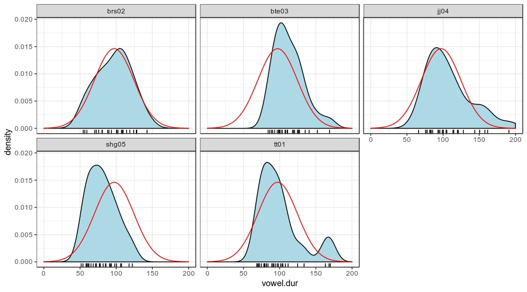
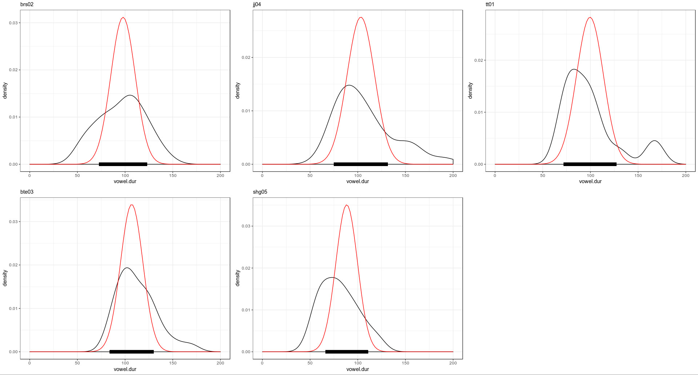

---
output:
  html_document:
    toc: false
editor_options: 
  chunk_output_type: console
---

## Домашнее задание (до 12.02.2019)

В вашей папке лежат данные исследования исландских данных [Coretta 2017]. В ваших данных наблюдения по длительности гласного [o] в разных контекстах для 5 спикеров.

* `speaker` --- ID спикера
* `vowel.dur` --- длительность гласного (в разных словах, в разных контекстах, но мы для простоты будем это игнорировать и считать все наблюдения независимыми).

Используя среднее с 10% усеченнием (аргумент `trim` функции `mean`) и стандартное отклонение от всех наблюдений в качестве параметров априорного нормального распределения (на верхнем графике красным), произведите байесовский апдейт данных каждого спикера (красным на графике внизу) и посчитайте для получившихся апосториорных распределений байесовский 95% интервал (толстая черная линия на графике внизу).

Все подсчеты в этом домашнем задании следует производить с точностью до последнего знака после запятой.

### 4.1
Выведите в консоль датафрейм со средним и стандартным отклонением апостериорного распределения спикера `brs02`.

### 4.2
Выведите в консоль датафрейм с границами байесовского 95% интервала для спикера `tt01`.